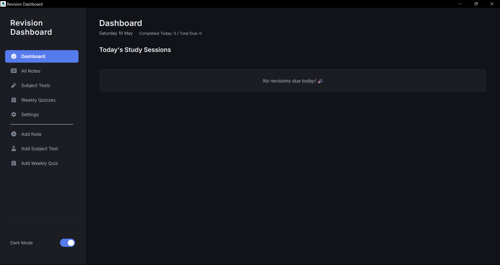
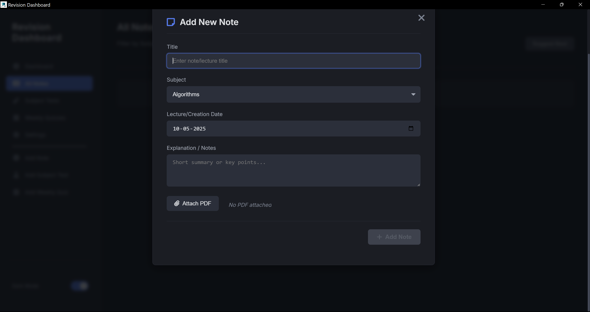
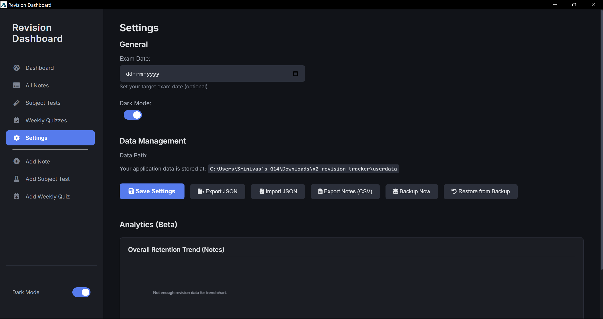

## A Revision Tracker for your notes and slides

### *19th April 2025*
#### *Srinivas Raghav V C*

---- 

Hey!

So, I had a really shitty revision schedule, often **clutterd and unorganized**.
So, I made this electron based app through vibe coding, not proud of it.

But hey, it works well and does the job atleast !

It basically employs a Spaced Repetion Algorithm and also has for Quizzes and Subject Tests !

Below is a AI Explanation of the thing !

<a href="https://drive.google.com/drive/folders/1TqUxPV2NGDdLWcoo1UqkKrUZtBIgxyHY?usp=sharing" target="_blank">**Drive Link of the Application Project.**</a>

--- 

  

  

  

  
## Introduction to FSRS

X2 Revision Tracker implements the Free Spaced Repetition Scheduler (FSRS), an advanced algorithm that optimizes your study schedule based on cognitive science principles. FSRS is a more sophisticated alternative to traditional spaced repetition algorithms like Anki's SM-2.

## How Spaced Repetition Works in X2
### Core Component

The system tracks three key metrics for each note or study item:

1. **Interval**: Number of days until the next review

2. **Stability**: How strong your memory is for this item (memory strength)

3. **Difficulty**: How challenging the item is for you personally
### Confidence Levels and Their Impact
When you review an item, you rate your confidence level:

<table class="confidence-table">
  <thead>
    <tr>
      <th width="25%">Confidence</th>
      <th width="15%">Rating</th>
      <th width="60%">Effect on Next Review</th>
    </tr>
  </thead>
  <tbody>
    <tr>
      <td><strong>Low</strong></td>
      <td class="rating-cell">1</td>
      <td class="effect-cell">
        <ul>
          <li>Shorter interval (reduced by 20%)</li>
          <li>Lower stability increase</li>
          <li>More frequent reviews</li>
        </ul>
      </td>
    </tr>
    <tr>
      <td><strong>Medium</strong></td>
      <td class="rating-cell">2</td>
      <td class="effect-cell">
        <ul>
          <li>Standard interval</li>
          <li>Normal stability increase</li>
          <li>Follows standard forgetting curve</li>
        </ul>
      </td>
    </tr>
    <tr>
      <td><strong>High</strong></td>
      <td class="rating-cell">3</td>
      <td class="effect-cell">
        <ul>
          <li>Longer interval (increased by 30%)</li>
          <li>Higher stability increase</li>
          <li>Less frequent reviews</li>
        </ul>
      </td>
    </tr>
  </tbody>
</table>

The system uses these ratings to adapt to your personal learning journey, ensuring efficient and effective retention.
## Memory Strength Visualization

### Understanding the Memory Strength Graph

The Memory Strength Graph visualizes your retention over time:

- **X-axis**: Timeline of your reviews

- **Y-axis**: Estimated memory retention (percentage)

- **Trend line**: Shows how your memory strength fluctuates based on your reviews and confidence ratings

### Memory Strength Categories

The system classifies your memory strength into intuitive categories:

<table class="confidence-table">
  <thead>
    <tr>
      <th width="20%">Memory State</th>
      <th width="20%">Stability Range</th>
      <th width="60%">Description</th>
    </tr>
  </thead>
  <tbody>
    <tr>
      <td><strong>Learning</strong></td>
      <td class="rating-cell">< 1</td>
      <td>Just beginning to learn, needs frequent review</td>
    </tr>
    <tr>
      <td><strong>Consolidating</strong></td>
      <td class="rating-cell">1-5</td>
      <td>Starting to remember, needs reinforcement</td>
    </tr>
    <tr>
      <td><strong>Known</strong></td>
      <td class="rating-cell">5-20</td>
      <td>Fairly well remembered, needs occasional review</td>
    </tr>
    <tr>
      <td><strong>Well-Known</strong></td>
      <td class="rating-cell">20-100</td>
      <td>Strongly remembered, needs infrequent review</td>
    </tr>
    <tr>
      <td><strong>Very Strong</strong></td>
      <td class="rating-cell">> 100</td>
      <td>Deeply embedded in long-term memory</td>
    </tr>
  </tbody>
</table>

## The Science Behind the Algorithm

The FSRS algorithm operates on the principle of the forgetting curve: without reinforcement, memory decays over time in a predictable pattern. By strategically scheduling reviews, the algorithm counters this decay.

For each review session, the FSRS algorithm:

1. Evaluates your current memory state based on previous reviews

2. Interprets your confidence rating for the current review

3. Recalculates the memory stability and difficulty

4. Determines the optimal next review date

## Optimizing Your Learning with Confidence Ratings

### When to Use Each Confidence Rating

- **Low**: When you struggled to recall or made errors

- **Medium**: When you recalled with some effort or hesitation

- **High**: When you recalled quickly and accurately
### How Each Rating Affects Your Learning Path

#### Low Confidence

When you rate an item with low confidence, the system recognizes that you're still in the early learning phase for this content. The review interval shortens, giving you more opportunities to strengthen the memory trace before it fades completely.

#### Medium Confidence

A medium confidence rating indicates moderate familiarity. The system applies standard interval calculations, gradually increasing the time between reviews as you continue to demonstrate recall.

#### High Confidence

High confidence ratings signal strong memory formation. The system increases intervals more aggressively, optimizing your study time by focusing more on challenging material while keeping well-known material fresh with less frequent reviews.

## Memory Strength Graph Patterns

Different patterns in your Memory Strength Graph can reveal insights about your learning:

- **Steady upward trend**: Consistent study habits leading to strong retention

- **Saw-tooth pattern**: Periods of forgetting followed by relearning

- **Plateaus**: Stability in memory strength for well-known material

- **Sharp drops**: Possible indicators of difficult material or long gaps between reviews

---

<!-- 

 -->

